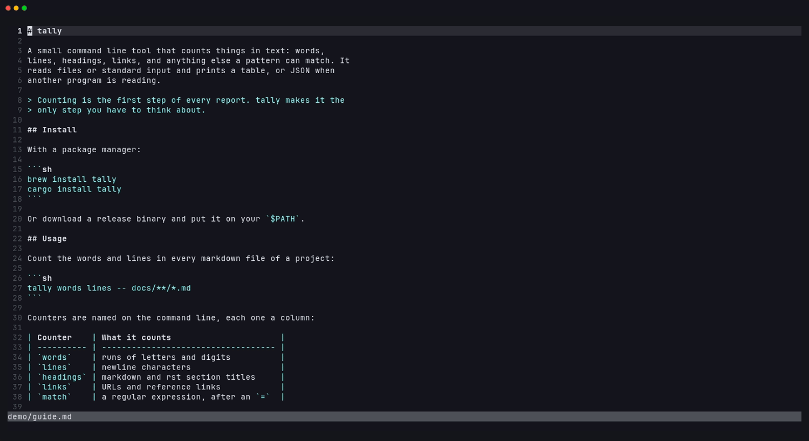
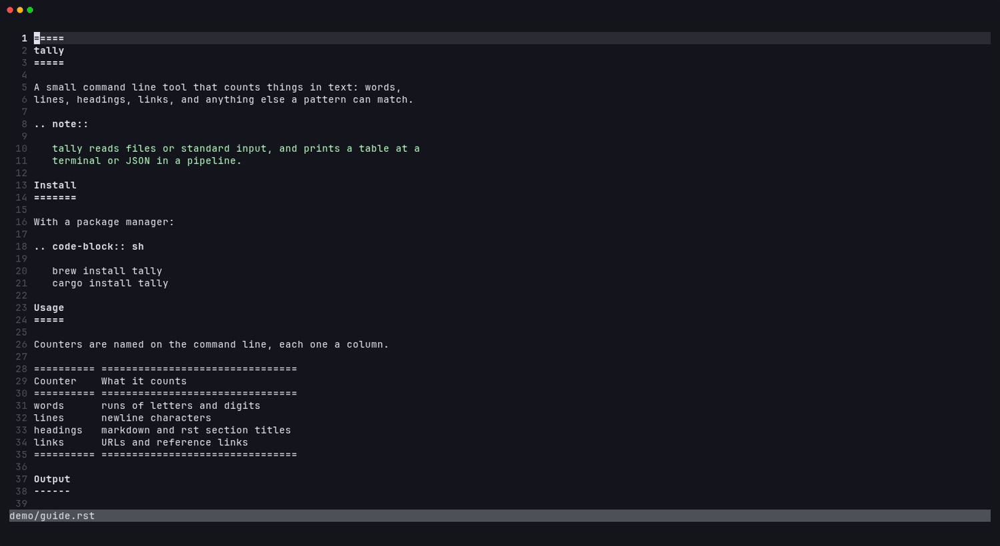
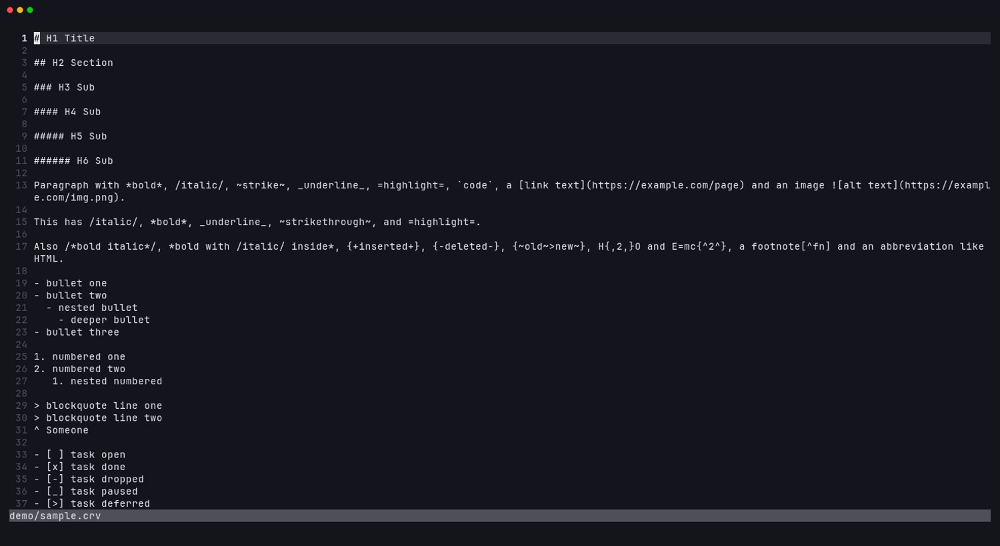
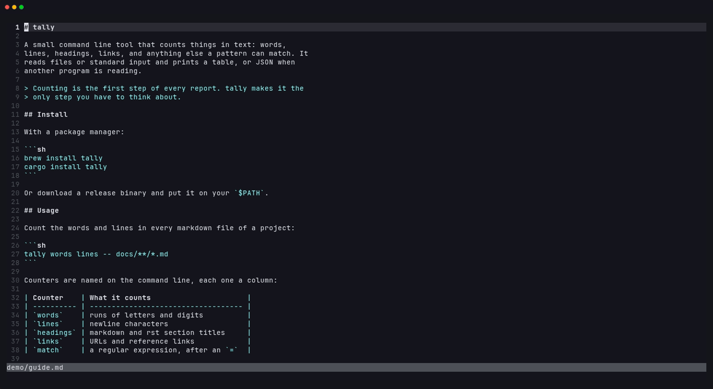

# beside.nvim

A live rendering of the document you are editing, in a split beside it. The
preview follows your cursor, scrolling the preview scrolls the source, and it
re-renders as you type. Rendering is done by a terminal renderer you already
have: leaf, glow, pandoc or carve, see [Supported renderers](#supported-renderers).


*Markdown rendered by leaf. Moving in either side scrolls the other.*

## Why another preview

The existing previews are each tied to one renderer, and some need node or a
browser. I like glow's output for some documents and leaf's for others, so
beside runs whichever renderer is installed and lets you switch with
`:Beside glow`. In-buffer renderers like render-markdown.nvim are a
different thing and work fine alongside it.

## Supported renderers

| Renderer | Renders | Install |
| --- | --- | --- |
| [leaf](https://github.com/RivoLink/leaf) | Markdown | [github.com/RivoLink/leaf](https://github.com/RivoLink/leaf#install) |
| [glow](https://github.com/charmbracelet/glow) | Markdown | [github.com/charmbracelet/glow](https://github.com/charmbracelet/glow#installation) |
| [pandoc](https://pandoc.org) 3.1.10+ | Markdown, reStructuredText, AsciiDoc, Org, Textile, Typst, Djot | [pandoc.org/installing](https://pandoc.org/installing.html) |
| [carve](https://markup-carve.github.io/carve) | Carve | [markup-carve.github.io/carve/get-started](https://markup-carve.github.io/carve/get-started) |

Markdown tries leaf, then glow, then pandoc; the first one installed renders.
Any other renderer is one table entry away, see
[Adding a renderer](#adding-a-renderer). When someone creates the next great
markup language, beside will be ready for it!


*reStructuredText rendered by pandoc.*


*Carve rendered by carve.*

## Requirements

- Neovim 0.10 or newer
- At least one of the [supported renderers](#supported-renderers) on `$PATH`.
  `:checkhealth beside` shows which are found and what each filetype would be
  rendered with.

## Install

With [lazy.nvim](https://github.com/folke/lazy.nvim):

```lua
{ 'mariocesar/beside.nvim', cmd = 'Beside', opts = {} }
```

`setup()` is optional; the defaults below apply without it. `:h beside` has
the full documentation.

## Use

`:Beside` toggles the preview for the current buffer. `:Beside glow` opens it
with that renderer, or switches to it; renderer names complete. While the
preview is open:

- moving or scrolling in the source keeps the preview at the same place, and
  scrolling the preview scrolls the source
- edits re-render 100 ms after you stop typing, unsaved
- opening another document in the same tab moves the preview to it; when no
  window shows the document any more, the preview closes
- `q` in the preview closes it


*`:Beside glow` switches the preview from leaf to glow.*

## Configuration

The defaults:

```lua
require('beside').setup({
  -- Preview width: fraction of the screen, or a column count when 2 or more
  width = 0.4,

  -- Milliseconds after the last change before re-rendering
  delay = 100,

  -- Renderers to try first, per filetype. Any other renderer declaring the
  -- filetype follows, by name; the first one installed renders.
  prefer = {
    markdown = { 'leaf', 'glow', 'pandoc' },
  },

  -- Renderers by name; the builtins are leaf, glow, pandoc and carve
  renderers = require('beside.renderers'),
})
```

User entries deep-merge into the defaults, so an option is set with
`renderers = { glow = { style = 'dracula' } }` and a filetype's order is
replaced with `prefer = { markdown = { 'glow' } }`.

### Adding a renderer

A renderer is a table with the filetypes it renders and a function building
the command that renders stdin to ANSI-colored text on stdout:

```lua
require('beside').setup({
  renderers = {
    mdcat = {
      filetypes = { markdown = true },
      command = function(context)
        return { 'mdcat', '--columns', tostring(context.width), '-' }
      end,
    },
  },
})
```

- `filetypes` maps each filetype to the format name the command needs, or to
  `true` when that is the filetype itself. pandoc's entry maps `markdown` to
  `gfm`, for example.
- `command(context)` returns the argv. `context` has `filetype`, `format` (what
  `filetypes` maps it to), `width` (columns to render at), `background`
  (`light` or `dark`) and `renderer` (the entry itself, with any user options
  merged in).
- `env`, optional, is extra environment for the command.
- `executable`, optional, is what must be on `$PATH`; the renderer's name by
  default.

The same shape is what `lua/beside/renderers.lua` uses for the builtins, so a
renderer worth sharing is a pull request adding an entry there; see
[CONTRIBUTING.md](CONTRIBUTING.md#adding-a-renderer).

### Per filetype

A buffer can override the settings in `vim.b.beside_config`, a table of the
same shape. Set one in `after/ftplugin/<filetype>.lua` to configure a filetype:

```lua
-- after/ftplugin/rst.lua
vim.b.beside_config = { prefer = { rst = { 'pandoc' } }, width = 0.5 }
```

Buffer variables cannot hold functions, so renderers themselves are added in
`setup()`.

## How the sync works

Renderers change the line count: a table becomes a box, a paragraph wraps, a
code block grows a frame. There is no line-for-line map, so beside matches the
text of each source line to the rendered output and interpolates between
matches. Headings, list items, code lines and table cells anchor exactly;
inside a wrapped paragraph the preview lands within a line or two.

## Contributing

Bug reports, fixes and new renderers are welcome. [CONTRIBUTING.md](CONTRIBUTING.md)
covers the dev setup, adding a renderer with its demo tape, and the renderer
quirks worth knowing about.

## License

MIT
